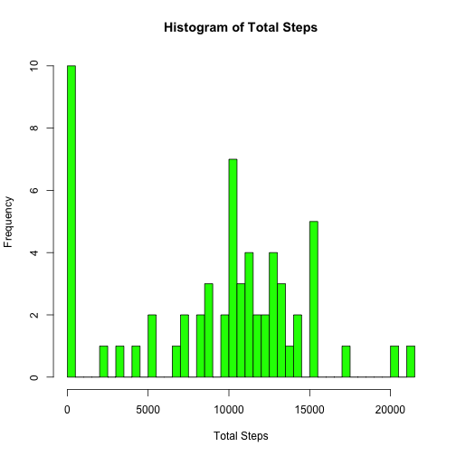
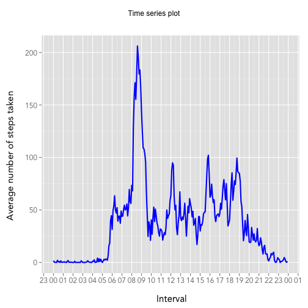
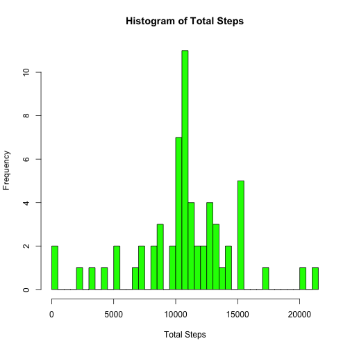
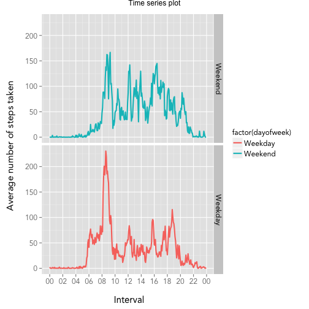

# Reproducible Research: Peer Assessment 1


## Library used for this project


```r
library(knitr)
library(dplyr)
library(ggplot2)
library(gridExtra)
library(lubridate)
```
________________________________________________________________________________
## Setting Global Options


```r
opts_chunk$set(echo = TRUE, results = "show")
```

________________________________________________________________________________
## Loading and preprocessing the data

#### Load the data


```r
# load data from the given csv file and create an activity dataset
activity <- read.csv("activity.csv")

# check the number of observations to make sure data is loaded correctly
str(activity)
```

```
## 'data.frame':	17568 obs. of  3 variables:
##  $ steps   : int  NA NA NA NA NA NA NA NA NA NA ...
##  $ date    : Factor w/ 61 levels "2012-10-01","2012-10-02",..: 1 1 1 1 1 1 1 1 1 1 ...
##  $ interval: int  0 5 10 15 20 25 30 35 40 45 ...
```

#### Preprocess the data


```r
# preprocess the data, kept the original date field as it is and create a new 
# datetime field which contains a dummy date(1980-01-01) but actual time in 
# HH:MM format the reason for this to create a plot for interval and format
# X-Axis in HH:MM ignore the date part of it. 

activity <- mutate(activity, 
                   hour = interval %/% 100, minute = interval %% 100, 
                   time = paste(hour, minute, sep=":"), 
                   datetime=as.POSIXct(strptime(paste("1980-01-01", 
                                                      time),"%Y-%m-%d %H:%M")))
```

________________________________________________________________________________
________________________________________________________________________________
________________________________________________________________________________
## Question 1: What is mean total number of steps taken per day?


```r
# create a new dataset for Question 1 from original dataset
activity1 <- activity
```

________________________________________________________________________________
#### Question 1 Part 1: Calculate total steps taken per day


```r
# using dplyr package, group the dataset by date 
activity1 <- group_by(activity1, date)

# calculate total steps per day using summarize()
activity1 <- summarize(activity1, total_steps = sum(steps, na.rm = TRUE))
```

________________________________________________________________________________
#### Question 1 Part 2: Make a histogram of the total number of steps taken each day


```r
# plot a histogram of each steps
hist(activity1$total_steps, col="green", breaks = 50, xlab = "Total Steps", 
     main = "Histogram of Total Steps")
```

 

________________________________________________________________________________
#### Question 1 Part 3: Calculate and report the mean and median of the total number of steps taken per day


```r
# calculate mean of the total number of steps taken per day
mean_steps <- format(mean(activity1$total_steps, na.rm = TRUE), digit=2)

# calculate median of the total number of steps taken per day
median_steps <- format(median(activity1$total_steps, na.rm = TRUE), digit=2)
```

The __mean__ of total steps taken per day is **9354**

The __median__ of total steps taken per day is **10395**

________________________________________________________________________________
________________________________________________________________________________
________________________________________________________________________________
## Question 2: What is the average daily activity pattern?


```r
# create a new dataset for Question 2 from original dataset
activity2 <- activity
```

________________________________________________________________________________
#### Question 2 Part 1: Make a time series plot (i.e. type = "l") of the 5-minute interval (x-axis) and the average number of steps taken, averaged across all days (y-axis)


```r
# using dplyr package, group the dataset by date 
activity2 <- group_by(activity2, datetime)

# calculate total steps per day using summarize()
activity2 <- summarize(activity2, ave_steps=mean(steps, na.rm=TRUE))

# use ggplot for ploting time series time interval on x-axis and ave_steps on y
t <- ggplot(activity2, aes(x=datetime, y=ave_steps))
t <- t + scale_x_datetime(labels = date_format("%H"), 
                          breaks = date_breaks("1 hour"))
t <- t + geom_line(size = 1, linetype=1, color = "blue")
t <- t + theme_gray(base_family = "Avenir", base_size = 15) 
t <- t + labs(x = "\n Interval") + labs(y = "Average number of steps taken \n")
grid.arrange(t, ncol=1, main = "\n Time series plot \n", as.table=TRUE)
```

 

________________________________________________________________________________
#### Question 2 Part 2: Which 5-minute interval, on average across all the days in the dataset, contains the maximum number of steps?


```r
# maximum number of steps
max_numberofstep <- format(max(activity2$ave_steps), digit=2)

# time interval for maximum number of steps
max_interval <- as.character(format(activity2[which.max(activity2$ave_steps),1],
                                    "%H:%M"))
```

The five minute __interval__ starting at **08:35** contains **206**  steps, which is the __maximum__.

________________________________________________________________________________
________________________________________________________________________________
________________________________________________________________________________

## Question 3: Imputing missing values
Note that there are a number of days/intervals where there are missing values (coded as NA). The presence of missing days may introduce bias into some calculations or summaries of the data.


```r
# create a new dataset for Question 3 from original dataset
activity3 <- activity
```

________________________________________________________________________________
#### Question 3 Part 1: Calculate and report the total number of missing values in the dataset (i.e. the total number of rows with NAs)


```r
#  calculate the missing value using complete.cases()
missing_rows <- nrow(activity3[is.na(activity3$steps), ])
```

Total number of rows with missing data (NAs) is **2304**

________________________________________________________________________________
#### Question 3 Part 2: Devise a strategy for filling in all of the missing values in the dataset. The strategy does not need to be sophisticated. For example, you could use the mean/median for that day, or the mean for that 5-minute interval, etc.

3 simple steps to fill the missing value with the mean for that 5-minute interval  
- Step 1: calculate mean for each 5-minute interval
- Step 2: find the row with missing value 
- Step 3: replace missing value with mean for that 5-minute interval


```r
# Step 1: group by interval and summarize the mean steps 
mean_data <- group_by(activity3, interval)

# calculate mean steps per each 5-minute interval
mean_data <- summarize(mean_data, ave_steps=mean(steps, na.rm=TRUE))

# Step 2 & 3: find the index of row which steps = NA and using a for loop and 
#            replace steps with mean steps for that interval

# iterate through the each rows in the dataset
for (i in 1:nrow(activity3))
{
    # check if this steps column is NA for this row
    if (is.na(activity3[i, 1]))
    {
        # replace steps with NA value with mean value of that interval
        activity3[i, 1]<- mean_data[which(mean_data$interval==activity3[i, 3]), 2]
    }
}
```

________________________________________________________________________________
#### Question 3 Part 3: Create a new dataset that is equal to the original dataset but with the missing data filled in.

The dataset __"activity3"__ is the new dataset which is filled with missing data 


```r
# calculate number of rows in original datase 
nrow_originaldataset <- nrow(activity)

# calculate number of rows in new dataset
nrow_newdataset <- nrow(activity3)

# calculate missing rows in the original dataset
nmissingrow_originaldataset <- nrow(activity[is.na(activity$steps), ])

# calculate missing rows in the new dataset
nmissingrow_newdataset <- nrow(activity3[is.na(activity3$steps), ])
```

- Number of rows in Original Dataset = **17568**  

- Number of rows in New Dataset = **17568**  

- Number of rows with missing values (NAs) in the original data **2304**  

- Number of rows with missing values (NAs) in the new data **0**  

________________________________________________________________________________
#### Question 3 Part 4: Make a histogram of the total number of steps taken each day and Calculate and report the mean and median total number of steps taken per day. Do these values differ from the estimates from the first part of the assignment? What is the impact of imputing missing data on the estimates of the total daily number of steps?


```r
# group by date and summarize total_steps
activity34 <- group_by(activity3, date)

# calculate total steps per day using summarize()
activity34 <- summarize(activity34, total_steps = sum(steps, na.rm = TRUE))

# plot a histogram
hist(activity34$total_steps, col="green", breaks = 50, xlab = "Total Steps", 
     main = "Histogram of Total Steps")
```

 

```r
# calculate mean of the total number of steps taken per day
new_mean_steps <- format(mean(activity34$total_steps, na.rm = TRUE), digit=2)

# calculate median of the total number of steps taken per day
new_median_steps <- format(median(activity34$total_steps, na.rm = TRUE), digit=2)
```

- The mean of total steps taken per day for new dataset is **10766**  

- The median of total steps taken per day for new dataset is **10766**  

Comparison of data set before and after filling NA. After imputting missing data mean and median values are pretty close to each other and it is different from the original value
________________________________________________________________________________

Dataset     |   Mean  |  Median  

Original    |  **9354** | **10395**  

New         | **10766** | **10766**  
________________________________________________________________________________


________________________________________________________________________________
________________________________________________________________________________
________________________________________________________________________________
## Question 4: Are there differences in activity patterns between weekdays and weekends?

For this part the weekdays() function may be of some help here. Use the dataset with the filled-in missing values for this part.


```r
# create a new dataset for Question 4 using the filled-in dataset from question 3
activity4 <- activity3
```
________________________________________________________________________________
#### Question 4 Part 1: Create a new factor variable in the dataset with two levels – “weekday” and “weekend” indicating whether a given date is a weekday or weekend day.


```r
# add a new variable call dayofweek which will contain two levels weekend 
# and weekday
activity4 <- mutate(activity4, 
                    dayofweek = ifelse(weekdays(as.POSIXct(date))=="Saturday" 
                                       | weekdays(as.POSIXct(date)) =="Sunday", 
                                       "Weekend", "Weekday"))
```

________________________________________________________________________________
#### Question 4 Part 2: Make a panel plot containing a time series plot (i.e. type = "l") of the 5-minute interval (x-axis) and the average number of steps taken, averaged across all weekday days or weekend days (y-axis). See the README file in the GitHub repository to see an example of what this plot should look like using simulated data.


```r
# using dplyr package, group the dataset by datetime and day of week
activity4 <- group_by(activity4, datetime, dayofweek)

# calculate average steps taken per day using summarize()
activity4 <- summarize(activity4, ave_steps=mean(steps, na.rm=TRUE))

t <- ggplot(activity4, aes(x=datetime, y=ave_steps))
t <- t + scale_x_datetime(labels = date_format("%H"), 
                          breaks = date_breaks("2 hour"))
t <- t + facet_grid(dayofweek ~ ., scales = "free_x", space="free", 
                    as.table=FALSE, labeller=label_value )
t <- t + geom_line(aes(colour = factor(dayofweek)), size = 1, linetype=1)
t <- t + theme_gray(base_family = "Avenir", base_size = 15) 
t <- t + labs(x = "\n Interval") + labs(y = "Average number of steps taken \n")
grid.arrange(t, ncol=1, main = "Time series plot", as.table=TRUE)
```

 

Over the weekend average number of maximum number of steps taken is less than 200 steps as opposed to weekdays 
